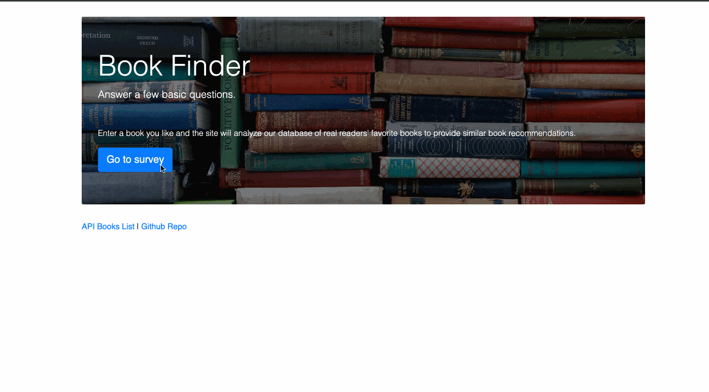
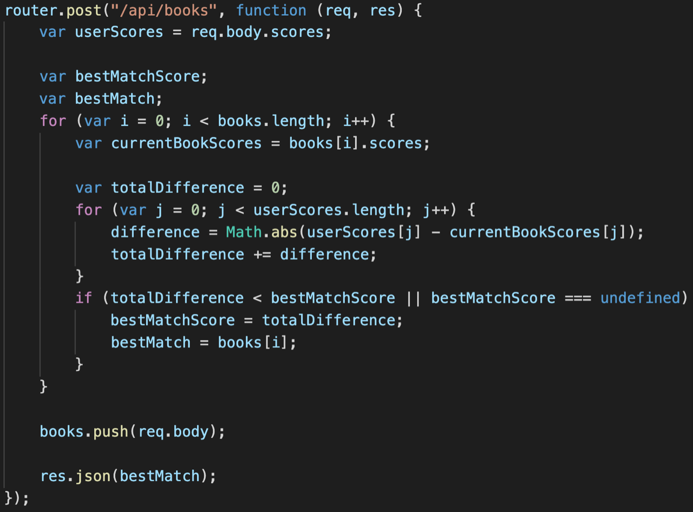
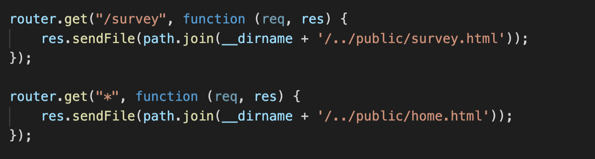

# BookFinder

This is a read-alike application -- an app for book recommendations based on books you've read and enjoyed before. Fill in our survey by answering questions about a book you love, then our full-stack site will compare your answers with those from other users. The app will then display the title and cover of the book that best matches your favorite book.

## Technologies Used
* Node.js & JavaScript
* Express
* Heroku

## User Flow GIFs
Answer questions about your favorite book and get recommendations for a similar book.

## Essential Code
Each user's scores are stored into a simple array of numbers (`userScores`).
We compare the difference between current user's scores against those from other users (`currentBookScores`), question by question. Add up the differences to calculate the totalDifference.

The closest match will be the user with the least amount of difference:

A GET Route to /survey which displays the survey page.
A catch-all route that leads to the home page.

## Links

[Book Finder App - Heroku](https://sheltered-beach-38162.herokuapp.com/)

[My LinkedIn](https://www.linkedin.com/in/leticiaroncero/?locale=en_US)

[Professional Portfolio](https://leticiaroncero.github.io/Responsive-Portfolio/portfolio.html)

